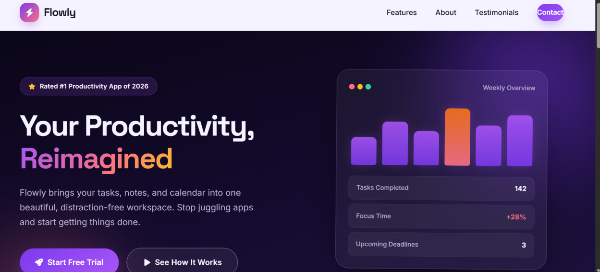
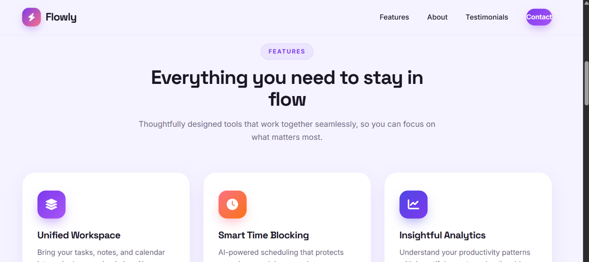
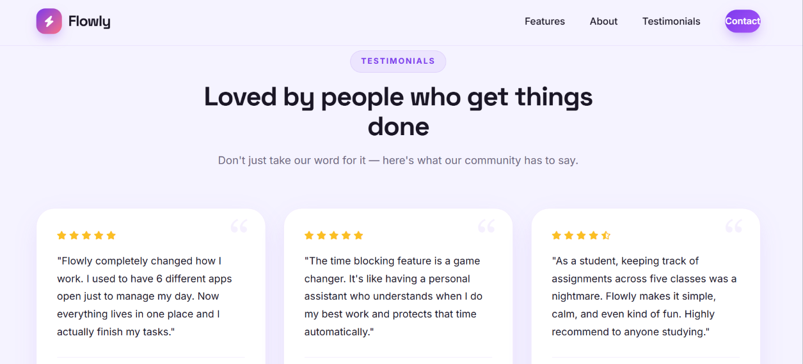
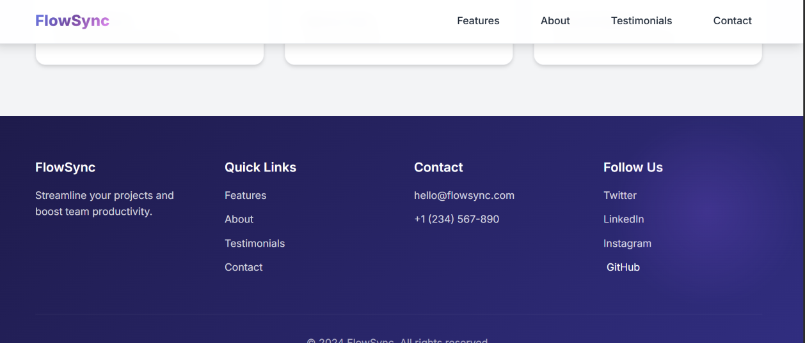

# OIBSIP-L1-Task1 Landing Page



A visually polished static landing page for FlowSync - a fictional project management SaaS product. This project demonstrates foundational HTML5 and CSS3 layout skills.

## Tech Stack

- **HTML5** - Semantic markup structure
- **CSS3** - Styling with modern features (Grid, Flexbox, Gradients, Animations)
- **No JavaScript** - Pure HTML/CSS implementation

## Features

- **Sticky Navigation Bar** - Fixed navigation with 4 links (Features, About, Testimonials, Contact)
- **Hero Section** - Eye-catching headline, subheadline, and call-to-action button with gradient background
- **Features Section** - 6 feature cards showcasing product capabilities with hover effects
- **About Section** - Company information with statistics and visual placeholder
- **Testimonials Section** - 3 customer review cards with star ratings
- **Footer** - Contact information, quick links, and social media placeholders

## Design Highlights

- **Modern Color Palette** - Purple/pink/blue gradient theme
- **Responsive Layout** - Fully responsive using CSS Grid and Flexbox
- **Smooth Animations** - Hover effects, transitions, and subtle animations
- **Glassmorphism Effects** - Backdrop blur on navigation
- **Gradient Text Effects** - Applied to logos, icons, and statistics
- **Clean Typography** - Inter font family with multiple sizes

## Project Structure

```
landingpage/
├── index.html          # Main HTML structure
├── styles.css          # Complete styling
├── README.md           # Project documentation
├── home.png            # Hero section screenshot
├── features.png        # Features section screenshot
├── about.png           # About section screenshot
└── contact.png         # Footer/Contact section screenshot
```

## How to Run

1. Clone the repository
2. Open `index.html` in a web browser
3. Or use a local server:
   ```bash
   python -m http.server 8000
   ```
4. Navigate to `http://localhost:8000`

## Requirements Met

✅ Fixed/sticky navigation bar with at least 3 navigation links  
✅ Hero section with headline, subheadline, and call-to-action button  
✅ At least 2 distinct content sections (Features, About, Testimonials)  
✅ Footer with placeholder contact/social links  
✅ Consistent color palette applied across all sections  
✅ Responsive layout using CSS Flexbox or Grid  
✅ No element overlap - all padding, margin, and box-sizing intentionally set  
✅ Clean, readable typography with at least 2 font sizes  

## Screenshots

### Hero Section


### Features Section


### About Section


### Footer/Contact Section


## Author

Created for Oasis Infobyte Level 1 Task 1 - Landing Page Project

## License

This project is open source and available for educational purposes.
